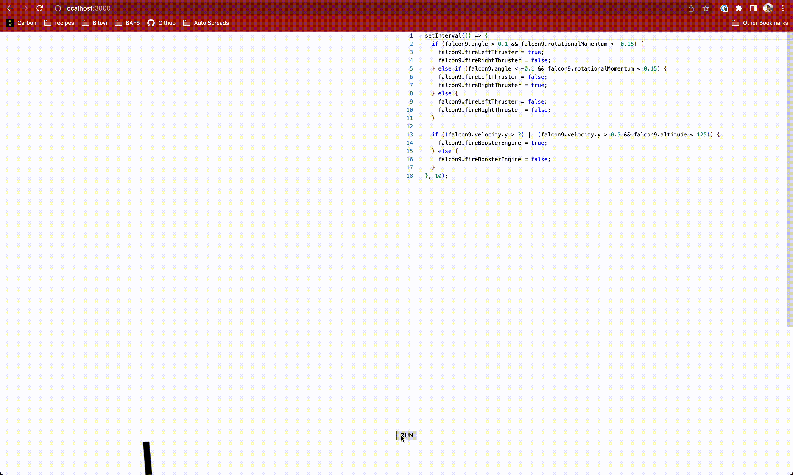

# lander

A 2D simulation game where you program rocket boosters to land.

[Play Now](https://lander.kurpuis.com)



## Develop

1. Install dependencies `npm i`
1. Start the dev server `npm start`
1. Navigate to [http://localhost:3000](http://localhost:3000)

## Play

1. Write code
1. Click `RUN`

__Example:__

```javascript
setInterval(() => {
  if (falcon9.angle > 0.1 && falcon9.rotationalMomentum > -0.15) {
    falcon9.fireLeftThruster = true;
    falcon9.fireRightThruster = false;
  } else if (falcon9.angle < -0.1 && falcon9.rotationalMomentum < 0.15) {
    falcon9.fireLeftThruster = false;
    falcon9.fireRightThruster = true;
  } else {
    falcon9.fireLeftThruster = false;
    falcon9.fireRightThruster = false;
  }

  if ((falcon9.velocity.y > 2) || (falcon9.velocity.y > 0.5 && falcon9.altitude < 125)) {
    falcon9.fireBoosterEngine = true;
  } else {
    falcon9.fireBoosterEngine = false;
  }
}, 10);
```
